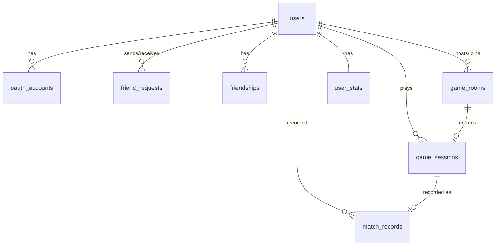

# Schema

## ER図

```
oauth_accounts ──FK──→ users
friend_requests ──FK──→ users (sender_id, receiver_id)
friendships ──FK──→ users (user_id, friend_id)
game_rooms ──FK──→ users (host_id, guest_id)
game_sessions ──FK──→ game_rooms (room_id)
game_sessions ──FK──→ users (player1_id, player2_id, winner_id)
match_records ──FK──→ game_sessions (session_id)
match_records ──FK──→ users (player1_id, player2_id, winner_id)
user_stats ──FK──→ users (user_id)
```



## テーブル数サマリー

| ドメイン | テーブル数 | テーブル名 |
|---|---|---|
| identity-and-access | 2 | users, oauth_accounts |
| social | 2 | friend_requests, friendships |
| matchmaking | 1 | game_rooms |
| game | 1 | game_sessions |
| stats | 2 | match_records, user_stats |
| **合計** | **8** | |

---

## Enum 定義

```sql
CREATE TYPE oauth_provider_type AS ENUM ('google', 'github');
CREATE TYPE friend_request_status AS ENUM ('pending', 'accepted', 'rejected');
CREATE TYPE friendship_status AS ENUM ('accepted', 'removed');
CREATE TYPE match_type AS ENUM ('keyword', 'invite', 'random', 'cpu');
CREATE TYPE cpu_level AS ENUM ('easy', 'medium', 'hard', 'oni');
CREATE TYPE game_room_status AS ENUM ('waiting', 'ready', 'playing', 'finished', 'cancelled');
CREATE TYPE game_session_status AS ENUM ('playing', 'paused', 'finished');
```

---

## Identity and Access

### users

| カラム名 | 型 | NOT NULL | DEFAULT | 説明 |
|---|---|---|---|---|
| id | UUID | ✅ | gen_random_uuid() | PK |
| email | VARCHAR(255) | ✅ | | メールアドレス (UQ) |
| password_hash | VARCHAR(255) | | | bcrypt ハッシュ（OAuth のみユーザーは NULL） |
| nickname | VARCHAR(20) | ✅ | | 表示名 (UQ, 1〜20文字) |
| avatar_url | TEXT | | | アバター画像 URL |
| created_at | TIMESTAMPTZ | ✅ | NOW() | 作成日時 |
| updated_at | TIMESTAMPTZ | ✅ | NOW() | 更新日時 |

**制約**: PK(id), UQ(email), UQ(nickname), CHECK(nickname 1〜20文字), CHECK(email RFC形式)

### oauth_accounts

| カラム名 | 型 | NOT NULL | DEFAULT | 説明 |
|---|---|---|---|---|
| id | UUID | ✅ | gen_random_uuid() | PK |
| user_id | UUID | ✅ | | FK → users.id (CASCADE) |
| provider | oauth_provider_type | ✅ | | プロバイダ名 |
| provider_user_id | VARCHAR(255) | ✅ | | プロバイダ側ユーザーID |
| created_at | TIMESTAMPTZ | ✅ | NOW() | 作成日時 |

**制約**: PK(id), UQ(provider, provider_user_id), FK(user_id → users ON DELETE CASCADE)

---

## Social

### friend_requests

| カラム名 | 型 | NOT NULL | DEFAULT | 説明 |
|---|---|---|---|---|
| id | UUID | ✅ | gen_random_uuid() | PK |
| sender_id | UUID | ✅ | | FK → users.id (CASCADE) |
| receiver_id | UUID | ✅ | | FK → users.id (CASCADE) |
| status | friend_request_status | ✅ | 'pending' | リクエスト状態 |
| created_at | TIMESTAMPTZ | ✅ | NOW() | 作成日時 |
| updated_at | TIMESTAMPTZ | ✅ | NOW() | 更新日時 |

**制約**: PK(id), UQ(sender_id, receiver_id), CHECK(sender_id != receiver_id)

### friendships

| カラム名 | 型 | NOT NULL | DEFAULT | 説明 |
|---|---|---|---|---|
| id | UUID | ✅ | gen_random_uuid() | PK |
| user_id | UUID | ✅ | | FK → users.id (CASCADE) |
| friend_id | UUID | ✅ | | FK → users.id (CASCADE) |
| status | friendship_status | ✅ | 'accepted' | 関係状態 |
| created_at | TIMESTAMPTZ | ✅ | NOW() | 作成日時 |
| updated_at | TIMESTAMPTZ | ✅ | NOW() | 更新日時 |

**制約**: PK(id), UQ(user_id, friend_id), CHECK(user_id != friend_id)

---

## Matchmaking

### game_rooms

| カラム名 | 型 | NOT NULL | DEFAULT | 説明 |
|---|---|---|---|---|
| id | UUID | ✅ | gen_random_uuid() | PK |
| match_type | match_type | ✅ | | マッチング方式 |
| keyword | VARCHAR(50) | | | あいことば（keyword時のみ） |
| host_id | UUID | ✅ | | FK → users.id (RESTRICT) |
| guest_id | UUID | | | FK → users.id (RESTRICT) |
| cpu_level | cpu_level | | | CPU難易度（cpu時のみ） |
| status | game_room_status | ✅ | 'waiting' | ルーム状態 |
| created_at | TIMESTAMPTZ | ✅ | NOW() | 作成日時 |
| updated_at | TIMESTAMPTZ | ✅ | NOW() | 更新日時 |

**制約**: PK(id), FK(host_id, guest_id → users ON DELETE RESTRICT), CHECK(keyword ⇔ match_type='keyword'), CHECK(cpu_level ⇔ match_type='cpu')

---

## Game

### game_sessions

| カラム名 | 型 | NOT NULL | DEFAULT | 説明 |
|---|---|---|---|---|
| id | UUID | ✅ | gen_random_uuid() | PK |
| room_id | UUID | ✅ | | FK → game_rooms.id (RESTRICT), UQ |
| player1_id | UUID | ✅ | | FK → users.id (RESTRICT) |
| player2_id | UUID | | | FK → users.id (RESTRICT)、CPU時NULL |
| is_cpu_game | BOOLEAN | ✅ | false | CPU対戦フラグ |
| cpu_level | cpu_level | | | CPU難易度 |
| winner_id | UUID | | | FK → users.id (RESTRICT)、進行中NULL |
| status | game_session_status | ✅ | 'playing' | セッション状態 |
| started_at | TIMESTAMPTZ | ✅ | NOW() | 開始日時 |
| finished_at | TIMESTAMPTZ | | | 終了日時 |
| created_at | TIMESTAMPTZ | ✅ | NOW() | 作成日時 |
| updated_at | TIMESTAMPTZ | ✅ | NOW() | 更新日時 |

**制約**: PK(id), UQ(room_id), CHECK(winner ∈ {player1, player2, NULL}), CHECK(is_cpu=true → player2=NULL), CHECK(finished → winner NOT NULL)

---

## Stats

### match_records (Ledger: append-only)

| カラム名 | 型 | NOT NULL | DEFAULT | 説明 |
|---|---|---|---|---|
| id | UUID | ✅ | gen_random_uuid() | PK |
| session_id | UUID | ✅ | | FK → game_sessions.id (RESTRICT), UQ |
| player1_id | UUID | ✅ | | FK → users.id (RESTRICT) |
| player2_id | UUID | | | FK → users.id (RESTRICT)、CPU時NULL |
| winner_id | UUID | ✅ | | FK → users.id (RESTRICT) |
| is_cpu_game | BOOLEAN | ✅ | false | CPU対戦フラグ |
| played_at | TIMESTAMPTZ | ✅ | | 対戦日時 |
| created_at | TIMESTAMPTZ | ✅ | NOW() | 記録作成日時 |

**制約**: PK(id), UQ(session_id)。UPDATE/DELETE はトリガーで禁止（immutable ledger）。

### user_stats

| カラム名 | 型 | NOT NULL | DEFAULT | 説明 |
|---|---|---|---|---|
| user_id | UUID | ✅ | | PK, FK → users.id (CASCADE) |
| wins | INTEGER | ✅ | 0 | 勝利数 |
| losses | INTEGER | ✅ | 0 | 敗北数 |
| rating | INTEGER | ✅ | 1000 | レーティング値 |
| updated_at | TIMESTAMPTZ | ✅ | NOW() | 最終更新日時 |

**制約**: PK(user_id), CHECK(wins >= 0), CHECK(losses >= 0), CHECK(rating >= 0)
