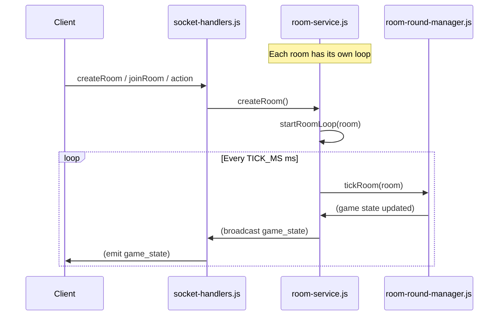

# Socket.IO Architecture & Integration Guide

## Overview: What is Socket.IO?

Socket.IO is a library for real-time, bidirectional communication between web clients and servers. It enables instant event-based messaging, typically using WebSockets under the hood, with automatic fallbacks for older browsers.

- **Server:** Listens for client connections, authenticates them, and manages real-time events.
- **Client:** Connects to the server and sends/receives events (e.g., player actions, game state updates).

---

## Project Structure & Key Files

| File                          | Responsibility                                      |
|-------------------------------|-----------------------------------------------------|
| `socket_server/index.js`      | Server setup, auth, dependency injection            |
| `socket_server/socket-handlers.js` | Event listeners for client actions                  |
| `socket_server/game/room-round-manager.js` | Game round logic, ticking, win/loss, countdowns  |
| `socket_server/game/room-service.js` | Room and player management, game loop control      |
| `frontend/app/game/hooks/registerGameSessionSocketHandlers.ts` | Client event wiring |

---

## How the Server Works

### 1. `index.js` — Server Initialization
- Sets up Express and HTTP server.
- Configures Socket.IO with CORS and JWT-based authentication.
- On each connection, verifies the JWT and attaches the user ID to the socket.
- Creates a `roomService` (the main game state manager).
- Calls `registerSocketHandlers(io, roomService)` to set up all event listeners for new connections.

### 2. `socket-handlers.js` — Handling Client Events
- For each new client connection, sets up event listeners (e.g., `createRoom`, `joinRoom`, etc.).
- Uses the `roomService` to manage rooms and players.
- Handles reconnections, room creation, joining, and emits relevant events back to the client.
- Delegates most game logic to `roomService` and, by extension, the round/session managers.

### 3. `room-round-manager.js` — Game Round Logic
- Implements the core game loop and round management.
- Handles ticking the game state, player elimination, win/loss detection, and countdowns.
- Exposes functions like `tryStartRound`, `tickRoom`, `notifyWaitingForOpponent`, etc.
- Called by `roomService` to advance the game state at a fixed tick rate.

### 4. `room-service.js` — Room and Game Loop Management
- Manages all rooms and players.
- Starts and stops the game loop for each room using `startRoomLoop`.
- Handles player actions, room creation, joining, and state broadcasting.

---

## How the Game Loop Works (`startRoomLoop`)

Each room has its own game loop, managed by `startRoomLoop` in `room-service.js`:

1. **Clears Any Existing Interval:**
	- Prevents multiple loops for the same room.
2. **Starts a New Interval:**
	- Runs every `TICK_MS` milliseconds (e.g., 1000/60 ms for 60 ticks/sec).
3. **Game State Update:**
	- Calls `roundManager.tickRoom(room)` to advance the game state.
4. **Stores the Interval:**
	- The interval ID is stored on the room object for later cleanup.

---

## Sequence Diagram: Room Game Loop and Event Flow



---

## How the Client Sends Data to the Server (`emit`)

- The client uses `socket.emit(eventName, data)` to send actions or information to the server.
- The server listens for these events in `socket-handlers.js` and updates the game state accordingly.

**Example (Client Side):**
```js
socket.emit("joinRoom", { roomId: "abc123", password: "secret", name: "Player1" });
```

- The server receives this event and processes it, possibly emitting a response back (e.g., `joinedRoom`, `roomError`).

---

## Client Event Handling: `registerGameSessionSocketHandlers`

- This function in the frontend wires up all the real-time communication for the game session.
- Registers handlers for all important events the server might emit (e.g., `gameConstants`, `roomCreated`, `joinedRoom`, `game_state`, `roomError`, etc.).
- Updates React state in response to server events.
- Emits events back to the server when needed (e.g., on connect, emits `reconnect`).

---

## Summary

- Socket.IO enables real-time, event-driven communication between the client and server.
- The server manages rooms, players, and game state, broadcasting updates at a fixed tick rate.
- The client sends actions using `emit` and updates its UI in response to server events.
- Each room/game runs independently, allowing for scalable multiplayer sessions.

---

For more details, see the code in `socket_server/` and `frontend/app/game/hooks/`.